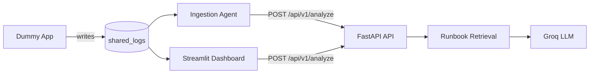

# DevOps Log Analyzer

An AI-assisted log monitoring stack that watches application logs, detects errors in real time, retrieves matching DevOps runbooks, and generates structured **Root Cause Analysis (RCA)** reports using a Groq-hosted LLM.

The project demonstrates a small multi-service setup: a simulated failing app, a log tailing agent, a FastAPI analysis API, and a Streamlit dashboard—all orchestrated with Docker Compose.

## Features

- **Simulated workload** — A dummy service writes realistic INFO and ERROR lines to a shared log file.
- **Real-time ingestion** — An agent tails the log file, keeps a rolling context window, and POSTs incidents to the API when it sees `ERROR`, `CRITICAL`, `FATAL`, or `Traceback`.
- **Runbook retrieval** — Keyword-based matching against an in-memory knowledge base (database, network, auth, and memory runbooks).
- **LLM-powered RCA** — [Groq](https://groq.com/) (`llama-3.1-8b-instant`) produces formatted root cause and remediation steps grounded in the matched documentation.
- **Web dashboard** — Streamlit UI for live log viewing and manual analysis of pasted error snippets.

## Architecture



| Service           | Role                                      | Port  |
|-------------------|-------------------------------------------|-------|
| `api_server`      | FastAPI backend, knowledge base, RCA      | 8000  |
| `dummy`           | Generates sample application logs         | —     |
| `ingestion_agent` | Tails logs and triggers analysis on errors| —     |
| `dashboard`       | Streamlit monitor and manual RCA          | 8502  |

## Prerequisites

- [Docker](https://docs.docker.com/get-docker/) and Docker Compose
- A [Groq API key](https://console.groq.com/) (free tier available)

## Quick start

1. **Clone the repository**

   ```bash
   git clone <repository-url>
   cd DevOps-Log
   ```

2. **Configure environment variables**

   Create a `.env` file in the project root:

   ```env
   GROQ_API_KEY=your_groq_api_key_here
   ```

3. **Start the stack**

   ```bash
   docker compose up --build
   ```

4. **Use the services**

   - **API docs:** http://localhost:8000/docs  
   - **Health check:** http://localhost:8000/health  
   - **Dashboard:** http://localhost:8502  

   The ingestion agent prints RCA reports to its container logs when the dummy app emits errors. The dashboard shows the latest log lines and lets you paste custom errors for analysis.

## API

### `GET /health`

Returns service status and the number of loaded runbook documents.

### `POST /api/v1/analyze`

Analyze a log incident.

**Request body:**

```json
{
  "error_line": "psycopg2.OperationalError: FATAL: too many connections",
  "context": "Full multi-line log context leading up to the error"
}
```

**Response:**

```json
{
  "status": "success",
  "error_analyzed": "...",
  "rca_report": "**ROOT CAUSE:**\n...\n\n**REMEDIATION PLAN:**\n..."
}
```

## Local development (without Docker)

1. Create a virtual environment and install dependencies:

   ```bash
   python -m venv venv
   source venv/bin/activate   # Windows: venv\Scripts\activate
   pip install -r requirements.txt
   ```

2. Add `GROQ_API_KEY` to `.env` in the project root.

3. Run services in separate terminals (from the project root):

   ```bash
   uvicorn src.main:app --reload --port 8000
   python src/dummy.py
   python src/ingestion.py
   streamlit run src/dashboard.py --server.port 8502
   ```

   For local runs, `ingestion.py` and `dashboard.py` default to `http://localhost:8000/api/v1/analyze`.

## Project structure

```
DevOps-Log/
├── docker-compose.yml    # Multi-service orchestration
├── Dockerfile
├── requirements.txt
├── logs/                 # Shared log output (created at runtime)
└── src/
    ├── main.py           # FastAPI app and /api/v1/analyze
    ├── ragPipeline.py    # Runbook knowledge base and retrieval
    ├── llmService.py     # Groq LLM and RCA prompt
    ├── ingestion.py      # Log tailing and incident triggers
    ├── dummy.py          # Simulated application logger
    └── dashboard.py      # Streamlit UI
```

## How it works

1. **Dummy app** (`dummy.py`) logs normal requests most of the time and randomly emits one of four realistic errors (PostgreSQL connections, payment gateway timeout, missing auth token, memory allocation).
2. **Ingestion agent** (`ingestion.py`) maintains the last 20 log lines. When an error pattern appears, it sends `error_line` and full `context` to the API.
3. **RAG pipeline** (`ragPipeline.py`) scores runbooks by keyword overlap with the error line and returns the best-matching documentation (or a default database runbook if nothing matches).
4. **LLM service** (`llmService.py`) combines the log context and retrieved docs into a structured RCA with **ROOT CAUSE** and **REMEDIATION PLAN** sections.

## Environment variables

| Variable        | Used by              | Description                                      |
|-----------------|----------------------|--------------------------------------------------|
| `GROQ_API_KEY`  | `api_server`         | Groq API key for LLM inference (required)        |
| `API_URL`       | `ingestion`, `dashboard` | Analyze endpoint (set automatically in Compose) |

## License

Add a license file if you plan to open-source this repository.
